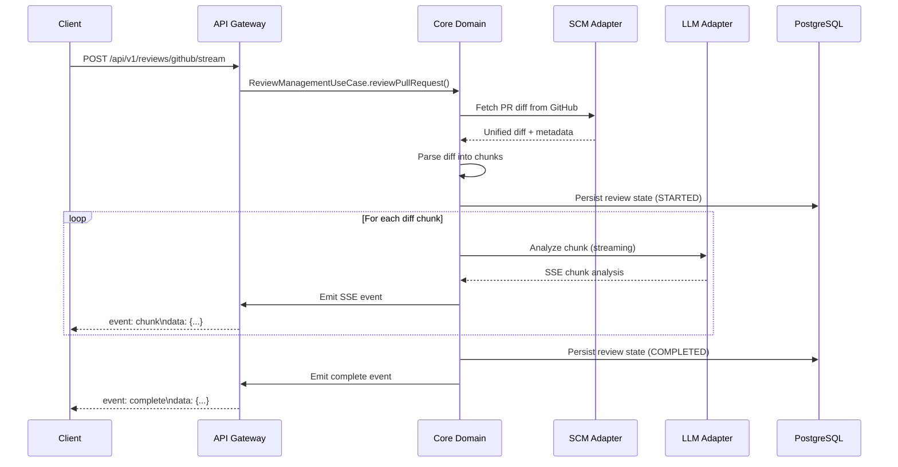

# AI Code Reviewer

**Multi-Provider AI Code Review System with Server-Sent Events (SSE) Architecture**

A modern, enterprise-grade code review automation platform that streams AI-powered code analysis for Pull Requests (GitHub) and Merge Requests (GitLab) with real-time feedback.

[](https://openjdk.java.net/)
[](https://spring.io/projects/spring-boot)
[](LICENSE)

---

## 🎯 Project Goals

- **Multi-Provider Support**: Seamlessly integrate with GitHub and GitLab platforms
- **Real-Time Streaming**: Server-Sent Events (SSE) for live AI analysis feedback
- **Reactive Architecture**: Built on Spring WebFlux for high concurrency and scalability
- **Modular Design**: Clean separation between core domain logic and API gateway
- **Production-Ready**: Database persistence, health monitoring, and Docker deployment

---

## 🏗️ Architecture

### **Multi-Module Maven Structure**

```
ai-code-reviewer/
├── api-gateway/          # REST API with SSE streaming endpoints
│   ├── controller/       # HTTP request handlers
│   ├── dto/             # Data transfer objects
│   ├── formatter/       # SSE message formatting
│   └── exception/       # Global error handling
│
├── core/                # Domain logic and infrastructure
│   ├── domain/
│   │   ├── model/       # Domain entities (DDD)
│   │   ├── port/        # Hexagonal architecture ports
│   │   └── service/     # Domain services
│   ├── infrastructure/
│   │   ├── adapter/     # SCM & LLM integrations
│   │   ├── factory/     # Provider factories
│   │   └── persistence/ # Database repositories
│   └── service/
│       ├── diff/        # Unified diff parsing
│       ├── prompt/      # LLM prompt engineering
│       └── validation/  # JSON schema validation
│
└── docker/              # Container orchestration
    ├── Dockerfile
    ├── docker-compose.yml
    └── docker-compose.dev.yml
```

### **Hexagonal Architecture (Ports & Adapters)**

```
┌─────────────────────────────────────────────────────────────┐
│                      API Gateway Layer                       │
│  (CodeReviewController, SSEFormatter, Exception Handling)   │
└─────────────────────┬───────────────────────────────────────┘
                      │
┌─────────────────────▼───────────────────────────────────────┐
│                     Domain Core Layer                        │
│  ┌─────────────────────────────────────────────────────┐   │
│  │  Domain Model (ReviewResult, DiffHunkBlock, etc.)   │   │
│  └─────────────────────────────────────────────────────┘   │
│  ┌─────────────────────────────────────────────────────┐   │
│  │  Ports (ReviewManagementUseCase, SCMPort, AIPort)   │   │
│  └─────────────────────────────────────────────────────┘   │
└─────────────────────┬───────────────────────────────────────┘
                      │
┌─────────────────────▼───────────────────────────────────────┐
│                 Infrastructure Adapters                      │
│  ┌──────────────┐  ┌──────────────┐  ┌──────────────┐     │
│  │ GitHubAdapter│  │GitLabAdapter │  │ OpenAIAdapter│     │
│  └──────────────┘  └──────────────┘  └──────────────┘     │
│  ┌──────────────────────────────────────────────────────┐  │
│  │     PostgresReviewRepository (JPA + Flyway)          │  │
│  └──────────────────────────────────────────────────────┘  │
└─────────────────────────────────────────────────────────────┘
```

---

## 🚀 Technology Stack

### **Core Technologies**
- **Java 21 LTS**: Modern language features (Records, Pattern Matching, Virtual Threads)
- **Spring Boot 3.5.5**: Enterprise application framework
- **Spring WebFlux**: Reactive web framework for non-blocking I/O
- **Project Reactor**: Reactive streams implementation

### **SCM Integrations**
- **GitHub API**: Pull Request analysis via `github-api` (v1.327)
- **GitLab API**: Merge Request processing via `gitlab4j-api` (v6.1.0)

### **AI/LLM Integration**
- **OpenAI API**: GPT-4o, GPT-4o-mini, GPT-3.5-turbo support
- **Streaming**: Real-time SSE responses from LLM providers
- **Circuit Breaker**: Resilience4j for fault tolerance

### **Database & Persistence**
- **PostgreSQL 15**: Primary data store
- **Spring Data JPA**: Object-relational mapping
- **Flyway**: Database schema migrations
- **HikariCP**: High-performance connection pooling

### **Testing & Quality**
- **JUnit 5**: Unit testing framework
- **Mockito**: Mocking framework
- **AssertJ**: Fluent assertions
- **Testcontainers**: Integration testing with PostgreSQL
- **Reactor Test**: Reactive stream testing
- **Spotless**: Google Java Style formatting

### **DevOps & Deployment**
- **Docker**: Containerization
- **Docker Compose**: Multi-container orchestration
- **Makefile**: Automated build and deployment scripts

---

## 📋 Prerequisites

### **Development Environment**
- **Java 21 LTS** or higher
- **Maven 3.9+** for dependency management
- **Docker & Docker Compose** for containerized deployment
- **PostgreSQL 15** (or use Docker Compose)

### **External Services**
- **GitHub Token** (for GitHub PR analysis)
- **GitLab Token** (for GitLab MR analysis)
- **OpenAI API Key** (for AI-powered code review)

---

## 🔧 Installation & Setup

### **1. Clone Repository**
```bash
git clone https://github.com/ghiloufibg/ai-code-reviewer.git
cd ai-code-reviewer
```

### **2. Configure Environment Variables**

Create a `.env` file in the project root:

```bash
# Database Configuration
DB_HOST=localhost
DB_PORT=5432
DB_NAME=ai_code_reviewer
DB_USER=reviewer
DB_PASSWORD=reviewer

# SCM Provider - GitHub
GITHUB_TOKEN=ghp_your_github_personal_access_token

# SCM Provider - GitLab
GITLAB_TOKEN=glpat_your_gitlab_personal_access_token
GITLAB_API_URL=https://gitlab.com/api/v4

# LLM Provider - OpenAI
OPENAI_API_KEY=sk-your-openai-api-key

# Feature Flags (Optional)
# EXPERIMENTAL: Automatic fix application via API (disabled by default)
# Requires security hardening before production use
# See: trackings/expert-panel-review-2025-01-16.md
# features.fix-application.enabled=false

# Logging
LOG_LEVEL=DEBUG
```

### ⚠️ **Experimental Features**

#### **Automatic Fix Application API** (Disabled by Default)

The system includes an **experimental API endpoint** for automatically applying AI-generated fixes directly to GitLab:

```
POST /api/v1/{provider}/{repositoryId}/change-requests/{changeRequestId}/issues/{issueId}/apply-fix
```

**Status:** 🔴 **EXPERIMENTAL - DISABLED BY DEFAULT**

**Why disabled:**
- Critical security blockers (code injection vulnerability)
- Transaction safety issues (no compensating transactions)
- Race condition risks (no optimistic locking)

**Production-Ready Alternative:**
The system already provides **GitLab native suggestions** in inline comments. Users can review and apply fixes with one click using GitLab's built-in "Apply suggestion" button. This approach:
- ✅ Is production-ready today
- ✅ Includes manual review for security
- ✅ Handled by GitLab's robust transaction system
- ✅ No race conditions or injection risks

**To Enable (Development/Testing Only):**
```yaml
# application.yml
features:
  fix-application:
    enabled: true  # ⚠️ Use only in development/testing
```

**Hardening Roadmap:** See `trackings/expert-panel-review-2025-01-16.md` for required security and reliability improvements before production use.

### **3. Build Project**
```bash
mvn clean install
```

### **4. Run with Docker Compose**

**Production Mode:**
```bash
make prod
# or
docker-compose up --build
```

**Development Mode (with hot reload):**
```bash
make dev
# or
docker-compose -f docker-compose.dev.yml up --build
```

### **5. Run Locally (without Docker)**

Start PostgreSQL:
```bash
docker run -d \
  -e POSTGRES_DB=ai_code_reviewer \
  -e POSTGRES_USER=reviewer \
  -e POSTGRES_PASSWORD=reviewer \
  -p 5432:5432 \
  postgres:15-alpine
```

Run application:
```bash
cd api-gateway
mvn spring-boot:run
```

---

## 📡 API Endpoints

### **Base URL**
```
http://localhost:8081
```

### **Code Review Endpoints**

#### **GitHub Pull Request Review (SSE Stream)**
```http
POST /api/v1/reviews/github/stream
Content-Type: application/json

{
  "owner": "octocat",
  "repository": "hello-world",
  "pullRequestNumber": 42,
  "model": "gpt-4o-mini"
}
```

**Response** (Server-Sent Events):
```
event: status
data: {"status":"STARTED","message":"Fetching pull request..."}

event: progress
data: {"file":"src/main/Main.java","progress":25}

event: chunk
data: {"file":"src/main/Main.java","severity":"WARNING","message":"..."}

event: complete
data: {"status":"COMPLETED","totalIssues":5}
```

#### **GitLab Merge Request Review (SSE Stream)**
```http
POST /api/v1/reviews/gitlab/stream
Content-Type: application/json

{
  "projectId": "12345",
  "mergeRequestIid": 10,
  "model": "gpt-4o"
}
```

### **Health & Monitoring**
```http
GET /actuator/health       # Application health status
GET /actuator/info         # Application information
GET /actuator/metrics      # Application metrics
```

---

## 🧪 Testing

### **Run All Tests**
```bash
mvn test
```

### **Run Specific Test Class**
```bash
mvn test -Dtest=GitHubDiffBuilderTest
```

### **Integration Tests (with Testcontainers)**
```bash
mvn verify
```

### **Code Formatting (Google Java Style)**
```bash
mvn spotless:apply
```

---

## 🛠️ Configuration

### **SCM Provider Configuration** (`application.yml`)

```yaml
scm:
  providers:
    github:
      enabled: true
      api-url: https://api.github.com
      token: ${GITHUB_TOKEN}

    gitlab:
      enabled: true
      api-url: ${GITLAB_API_URL:https://gitlab.com/api/v4}
      token: ${GITLAB_TOKEN}
```

### **LLM Provider Configuration**

```yaml
llm:
  provider:
    active: OPENAI
    max-retries: 3
    circuit-breaker:
      failure-threshold: 50.0
      timeout: 30s

  providers:
    openai:
      enabled: true
      api-key: ${OPENAI_API_KEY}
      base-url: https://api.openai.com/v1
      default-model: gpt-4o-mini
      available-models:
        - gpt-4o
        - gpt-4o-mini
        - gpt-3.5-turbo
      max-tokens: 4000
      temperature: 0.1
      stream-enabled: true
      timeout: 60s
```

### **Database Configuration**

```yaml
spring:
  datasource:
    url: jdbc:postgresql://${DB_HOST:localhost}:5432/${DB_NAME:ai_code_reviewer}
    username: ${DB_USER:reviewer}
    password: ${DB_PASSWORD:reviewer}
    hikari:
      maximum-pool-size: 10
      minimum-idle: 2
      connection-timeout: 30000

  jpa:
    hibernate:
      ddl-auto: validate
    properties:
      hibernate:
        dialect: org.hibernate.dialect.PostgreSQLDialect

  flyway:
    enabled: true
    baseline-on-migrate: true
    locations: classpath:db/migration
```

---

## 📊 How It Works



### **Processing Pipeline**

1. **Request Reception**: API Gateway receives GitHub/GitLab review request
2. **Diff Retrieval**: SCM adapter fetches unified diff from GitHub/GitLab API
3. **Diff Parsing**: `UnifiedDiffParser` breaks diff into `DiffHunkBlock` chunks
4. **Prompt Engineering**: `PromptBuilder` creates context-aware LLM prompts
5. **AI Streaming Analysis**: OpenAI adapter streams analysis results via SSE
6. **JSON Validation**: `ReviewResultValidator` validates against JSON schema
7. **Database Persistence**: Results stored in PostgreSQL with Flyway migrations
8. **SSE Broadcasting**: Real-time events streamed to client via `SSEFormatter`

---

## 🐳 Docker Deployment

### **Production Deployment**
```bash
# Start all services (PostgreSQL + AI Reviewer)
make prod

# View logs
docker-compose logs -f ai-code-reviewer

# Stop services
make down
```

### **Development Deployment (with debug port 5005)**
```bash
make dev
```

### **Environment Variables**
Set in `.env` file or pass to `docker-compose`:

```bash
GITHUB_TOKEN=ghp_xxx \
GITLAB_TOKEN=glpat_xxx \
OPENAI_API_KEY=sk-xxx \
docker-compose up
```

---

## 📈 Monitoring & Observability

### **Actuator Endpoints**
- **Health Check**: `http://localhost:8081/actuator/health`
- **Application Info**: `http://localhost:8081/actuator/info`
- **Metrics**: `http://localhost:8081/actuator/metrics`

### **Logs**
Application logs are written to:
- **Console**: Structured logging with timestamps
- **Docker Volume**: `/app/logs` (mounted to `ai-reviewer-logs`)

---

## 🔐 Security Considerations

- **API Tokens**: Stored as environment variables, never committed to source control
- **Database Credentials**: Managed via environment variables
- **HTTPS**: Recommended for production deployments
- **Token Permissions**: GitHub tokens require `repo` scope, GitLab tokens require `api` scope

---

## 🛠️ Troubleshooting

### **Database Connection Issues**
```bash
# Check PostgreSQL is running
docker ps | grep postgres

# Verify connection
psql -h localhost -U reviewer -d ai_code_reviewer
```

### **GitHub/GitLab API Errors**
- Verify token has correct permissions
- Check API rate limits
- Review `GITHUB_TOKEN` / `GITLAB_TOKEN` environment variables

### **LLM Streaming Errors**
- Verify `OPENAI_API_KEY` is valid
- Check network connectivity to `api.openai.com`
- Review circuit breaker configuration (may be open after failures)

### **Docker Build Failures**
```bash
# Clean Docker resources
make clean

# Rebuild from scratch
docker-compose build --no-cache
```

---

## 📝 Development Guidelines

### **Code Formatting**
This project enforces **Google Java Style** via Spotless:

```bash
# Format all code
mvn spotless:apply

# Check formatting
mvn spotless:check
```

### **Testing Standards**
- Minimum **70% test coverage** required
- Follow **TDD** (Test-Driven Development)
- Use **AssertJ** for fluent assertions
- Integration tests use **Testcontainers**

### **Commit Conventions**
Follow **Conventional Commits** format:

```
feat: add GitLab merge request streaming support
fix: resolve diff parsing issue for renamed files
docs: update README with deployment instructions
test: add integration tests for PostgreSQL persistence
```

---

## 📄 License

This project is licensed under the **Apache License 2.0** - see the [LICENSE](LICENSE) file for details.

---

## 🤝 Contributing

Contributions are welcome! Please follow these steps:

1. Fork the repository
2. Create a feature branch (`git checkout -b feature/amazing-feature`)
3. Commit your changes (`git commit -m 'feat: add amazing feature'`)
4. Format code (`mvn spotless:apply`)
5. Run tests (`mvn test`)
6. Push to branch (`git push origin feature/amazing-feature`)
7. Open a Pull Request

---

## 🙏 Acknowledgments

- **Spring Team**: For the excellent Spring Boot and WebFlux frameworks
- **GitHub API**: For comprehensive Pull Request integration
- **GitLab API**: For Merge Request analysis capabilities
- **OpenAI**: For powerful code analysis models
- **Community Contributors**: For bug reports and feature suggestions

---

**Built with ❤️ using Java 21, Spring Boot, and AI**
